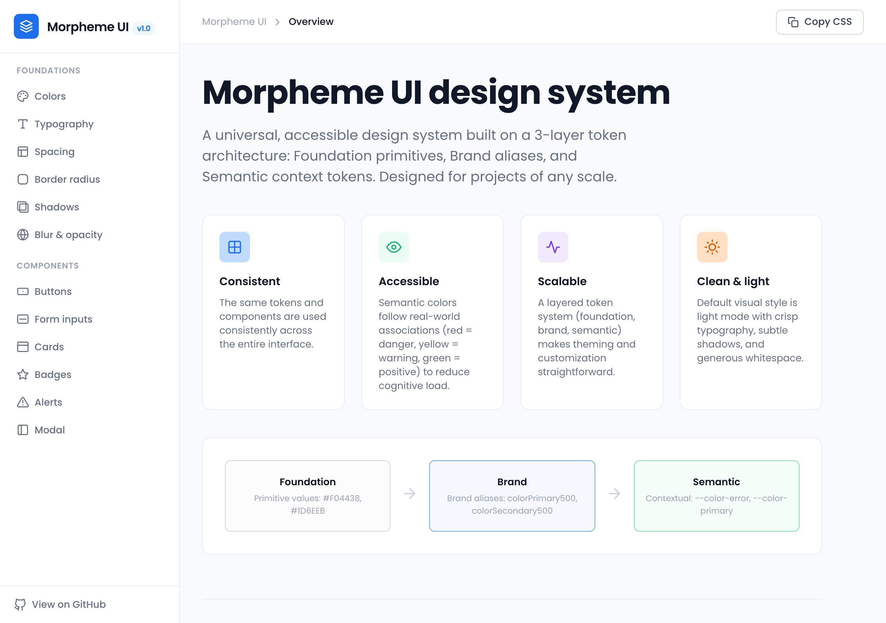
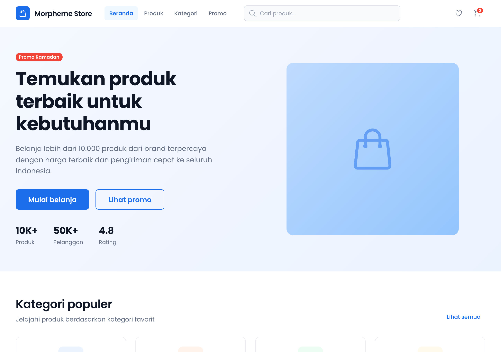
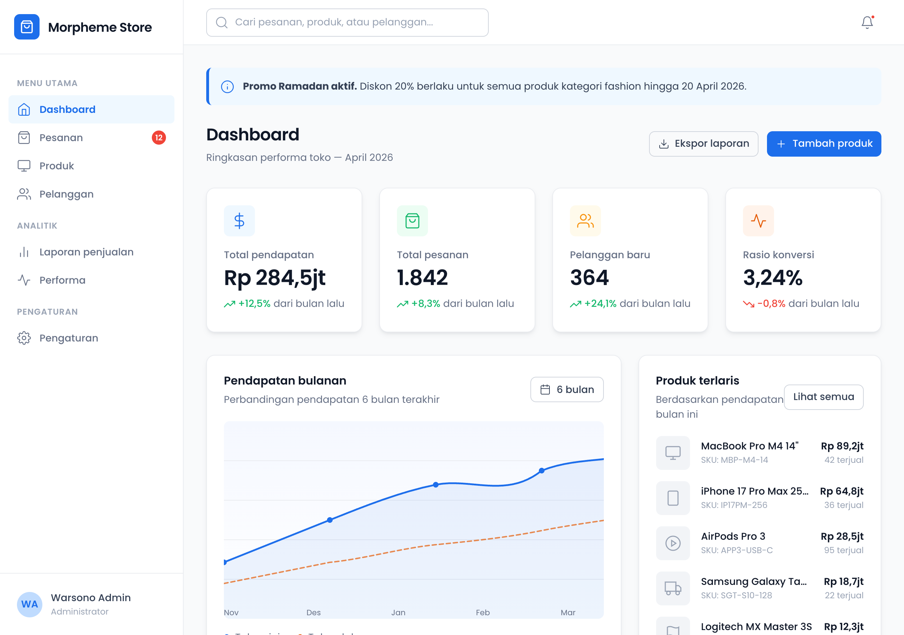

# Morpheme Design Skill

A Claude Code skill that enforces the **Morpheme UI Design System** by [gits.id](https://gits.id) when building web pages, apps, or UI components. Includes the full design system specification and 12 example implementations.







## What's inside

```
DESIGN.md                    # Full design system specification
CLAUDE.md                    # Claude Code project instructions
.claude/skills/              # Morpheme design skill for Claude Code
examples/
  docs/                      # Design system documentation & showcase
  auth/                      # Login, register, forgot password, OTP
  blog/                      # Article listing + article detail
  crm/                       # CRM admin with contacts table + detail panel
  dashboard/                 # E-commerce admin dashboard
  e-commerce/                # Multi-page storefront (5 pages)
  ai-chat/                   # Claude.ai/ChatGPT-style AI chat interface
  email/                     # 3-panel email/inbox client
  errors/                    # 404, 500, maintenance pages
  pricing/                   # Pricing plans + feature comparison + FAQ
  saas-landing-page/         # SaaS landing page
  settings/                  # Profile & account settings with toggles
```

## Design system overview

Morpheme UI uses a **3-layer token architecture**:

```
Foundation Colors  →  Brand Colors  →  Semantic Colors
(primitives)          (product)        (contextual UI)
```

### Key tokens

| Category | Default |
|----------|---------|
| Primary color | `#1D6EEB` (blue) |
| Secondary color | `#E55B05` (orange) |
| Font family | Poppins |
| Spacing base | 4px grid |
| Border radius | 4px – 16px scale |
| Shadows | 6-level elevation scale |

### What's documented in DESIGN.md

- Color system (foundation, brand, semantic scales)
- Typography (type scale, weight usage)
- Spacing system (4px base unit)
- Border radius, shadows, blur & opacity
- Component specs (buttons, inputs, cards, badges, alerts, modals, navigation)
- Layout & grid (12-column, breakpoints)
- Motion & animation tokens
- Accessibility guidelines
- CSS custom properties reference

## Installing the skill

### Recommended: one command

```bash
npx skills add https://github.com/gravitano/morpheme-design-skill --skill morpheme-design
```

This installs the skill directly into your current project's `.claude/skills/` directory.

### Option 1: Clone this repo

Clone the repo into your project or a shared location — the skill is ready to use:

```bash
git clone https://github.com/gravitano/morpheme-design-skill.git
cd morpheme-design-skill
claude  # start Claude Code — the skill is auto-discovered
```

### Option 2: Copy into an existing project

Copy the `.claude/skills/morpheme-design/` directory and `DESIGN.md` into your project:

```bash
# From your project root
mkdir -p .claude/skills/morpheme-design

# Copy the skill and design reference
cp /path/to/morpheme-design-skill/.claude/skills/morpheme-design/SKILL.md .claude/skills/morpheme-design/
cp /path/to/morpheme-design-skill/DESIGN.md .

# Optionally copy the CLAUDE.md for project-level instructions
cp /path/to/morpheme-design-skill/CLAUDE.md .
```

### Option 3: Install via Claude Code `/install-skill`

```bash
# Inside Claude Code
/install-skill https://github.com/gravitano/morpheme-design-skill
```

### Verify installation

After installing, start Claude Code and check that the skill is available:

```
/skills  # should list "morpheme-design"
```

## Using the skill

Once installed, the `/morpheme-design` skill automatically enforces the design system when building UI:

```bash
# Invoke manually with a prompt
/morpheme-design build a pricing page in HTML

# The skill also auto-triggers when you ask Claude to build any UI
# e.g. "build a login page" will activate the skill automatically
```

The skill ensures all generated code follows Morpheme tokens, component specs, and accessibility requirements.

## Running examples

All examples are static HTML — open any page directly in a browser:

```bash
# Documentation & showcase
open examples/docs/index.html            # Design system docs

# App examples
open examples/e-commerce/index.html      # Multi-page storefront
open examples/dashboard/index.html       # Admin dashboard
open examples/crm/index.html             # CRM contacts manager
open examples/email/index.html           # Email inbox client
open examples/ai-chat/index.html         # AI chat interface

# Page examples
open examples/auth/login.html            # Auth flow (login/register/otp)
open examples/blog/index.html            # Blog listing + article
open examples/pricing/index.html         # Pricing + FAQ
open examples/settings/index.html        # Profile settings
open examples/saas-landing-page/index.html

# Error pages
open examples/errors/404.html
open examples/errors/500.html
open examples/errors/maintenance.html
```

## License

Design system based on Morpheme UI by gits.id.
